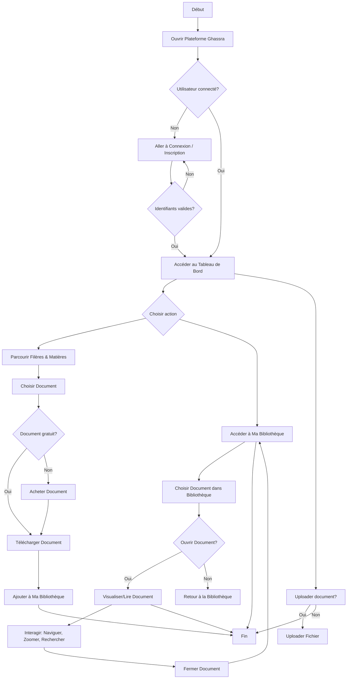

```mermaid
flowchart TD
Début --> OuvrirSite[Ouvrir Plateforme Ghassra]

OuvrirSite --> Connecté{Utilisateur connecté?}

Connecté -- Non --> PageLogin[Aller à Connexion / Inscription]
PageLogin --> Auth{Identifiants valides?}
Auth -- Non --> PageLogin
Auth -- Oui --> TableauBord

Connecté -- Oui --> TableauBord[Accéder au Tableau de Bord]

TableauBord --> Action{Choisir action}

Action --> Parcourir[Parcourir Filères & Matières]
Action --> MaBibliothèque[Accéder à Ma Bibliothèque]

Parcourir --> ChoisirDoc[Choisir Document]
ChoisirDoc --> Gratuit{Document gratuit?}
Gratuit -- Oui --> Télécharger[Télécharger Document]
Gratuit -- Non --> Acheter[Acheter Document]
Acheter --> Télécharger
Télécharger --> AjouterBibliothèque[Ajouter à Ma Bibliothèque]

MaBibliothèque --> OuvrirDocChoisi[Choisir Document dans Bibliothèque]
OuvrirDocChoisi --> Ouvrir{Ouvrir Document?}
Ouvrir -- Oui --> Visualiser[Visualiser/Lire Document]
Ouvrir -- Non --> RetourBibliothèque[Retour à la Bibliothèque]

Visualiser --> Interagir[Interagir: Naviguer, Zoomer, Rechercher]
Interagir --> Fermer[Fermer Document]
Fermer --> MaBibliothèque

TableauBord --> UploadChoix[Uploader document?]
UploadChoix -- Oui --> Upload[Uploader Fichier]
UploadChoix -- Non --> Fin

Visualiser --> Fin
MaBibliothèque --> Fin
AjouterBibliothèque --> Fin
```
