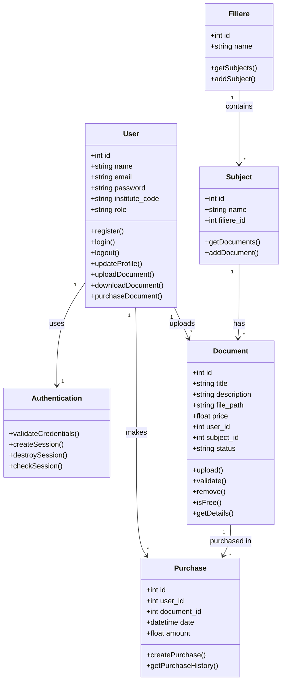

```mermaid
classDiagram

class User {
  +int id
  +string name
  +string email
  +string password
  +string institute_code
  +string role
  +register()
  +login()
  +logout()
  +updateProfile()
  +uploadDocument()
  +downloadDocument()
  +purchaseDocument()
}

class Filiere {
  +int id
  +string name
  +getSubjects()
  +addSubject()
}

class Subject {
  +int id
  +string name
  +int filiere_id
  +getDocuments()
  +addDocument()
}

class Document {
  +int id
  +string title
  +string description
  +string file_path
  +float price
  +int user_id
  +int subject_id
  +string status
  +upload()
  +validate()
  +remove()
  +isFree()
  +getDetails()
}

class Purchase {
  +int id
  +int user_id
  +int document_id
  +datetime date
  +float amount
  +createPurchase()
  +getPurchaseHistory()
}

class Authentication {
  +validateCredentials()
  +createSession()
  +destroySession()
  +checkSession()
}

Filiere "1" --> "*" Subject : contains
Subject "1" --> "*" Document : has
User "1" --> "*" Document : uploads
User "1" --> "*" Purchase : makes
Document "1" --> "*" Purchase : purchased in
User "1" --> "1" Authentication : uses
```
