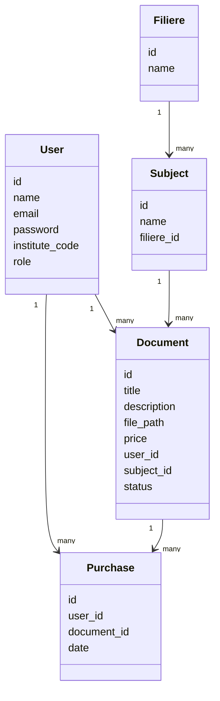

# Class Diagram — Ghassra

```mermaid
classDiagram

class User {
  id
  name
  email
  password
  institute_code
  role
}

class Filiere {
  id
  name
}

class Subject {
  id
  name
  filiere_id
}

class Document {
  id
  title
  description
  file_path
  price
  user_id
  subject_id
  status
}

class Purchase {
  id
  user_id
  document_id
  date
}

Filiere "1" --> "many" Subject
Subject "1" --> "many" Document
User "1" --> "many" Document
User "1" --> "many" Purchase
Document "1" --> "many" Purchase
```
