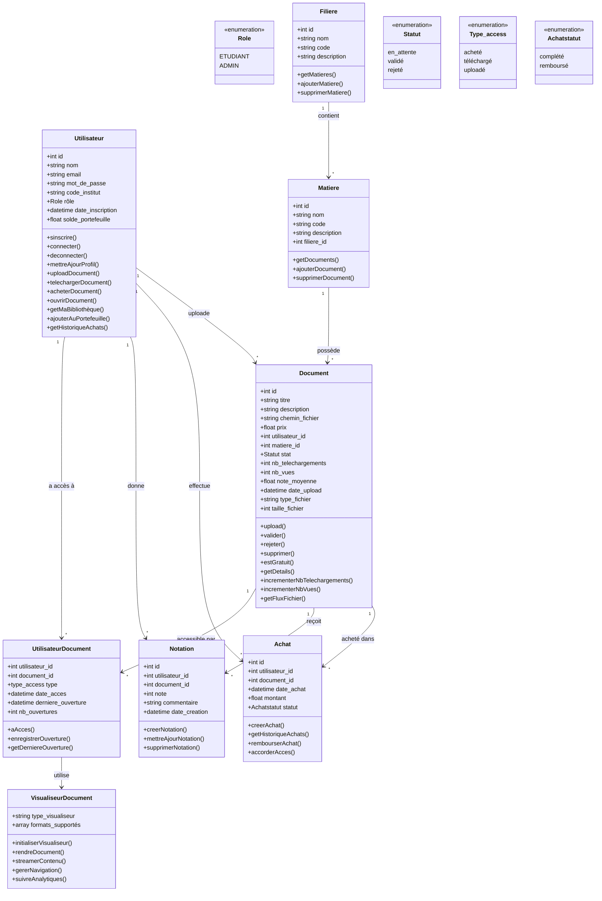

```mermaid
classDiagram
class Role {
    <<enumeration>>
    ETUDIANT
    ADMIN
}
class Utilisateur {
    +int id
    +string nom
    +string email
    +string mot_de_passe
    +string code_institut
    +Role rôle
    +datetime date_inscription
    +float solde_portefeuille
    +sinscrire()
    +connecter()
    +deconnecter()
    +mettreAjourProfil()
    +uploadDocument()
    +telechargerDocument()
    +acheterDocument()
    +ouvrirDocument()
    +getMaBibliothèque()
    +ajouterAuPortefeuille()
    +getHistoriqueAchats()
}

class Filiere {
    +int id
    +string nom
    +string code
    +string description
    +getMatieres()
    +ajouterMatiere()
    +supprimerMatiere()
}

class Matiere {
    +int id
    +string nom
    +string code
    +string description
    +int filiere_id
    +getDocuments()
    +ajouterDocument()
    +supprimerDocument()
}
class Statut {
    <<enumeration>>
    en_attente
    validé
    rejeté
}
class Document {
    +int id
    +string titre
    +string description
    +string chemin_fichier
    +float prix
    +int utilisateur_id
    +int matiere_id
    +Statut stat
    +int nb_telechargements
    +int nb_vues
    +float note_moyenne
    +datetime date_upload
    +string type_fichier
    +int taille_fichier
    +upload()
    +valider()
    +rejeter()
    +supprimer()
    +estGratuit()
    +getDetails()
    +incrementerNbTelechargements()
    +incrementerNbVues()
    +getFluxFichier()
}
class Type_access {
    <<enumeration>>
    acheté
    téléchargé
    uploadé
}
class UtilisateurDocument {
    +int utilisateur_id
    +int document_id
    +type_access type
    +datetime date_acces
    +datetime derniere_ouverture
    +int nb_ouvertures
    +aAcces()
    +enregistrerOuverture()
    +getDerniereOuverture()
}
class Achatstatut{
    <<enumeration>>
    complété
    remboursé
}
class Achat {
    +int id
    +int utilisateur_id
    +int document_id
    +datetime date_achat
    +float montant
    +Achatstatut statut
    +creerAchat()
    +getHistoriqueAchats()
    +rembourserAchat()
    +accorderAcces()
}

class Notation {
    +int id
    +int utilisateur_id
    +int document_id
    +int note
    +string commentaire
    +datetime date_creation
    +creerNotation()
    +mettreAjourNotation()
    +supprimerNotation()
}

class VisualiseurDocument {
    +string type_visualiseur
    +array formats_supportés
    +initialiserVisualiseur()
    +rendreDocument()
    +streamerContenu()
    +gererNavigation()
    +suivreAnalytiques()
}

Filiere "1" --> "*" Matiere : contient
Matiere "1" --> "*" Document : possède
Utilisateur "1" --> "*" Document : uploade
Utilisateur "1" --> "*" Achat : effectue
Document "1" --> "*" Achat : acheté dans
Utilisateur "1" --> "*" Notation : donne
Document "1" --> "*" Notation : reçoit
Utilisateur "1" --> "*" UtilisateurDocument : a accès à
Document "1" --> "*" UtilisateurDocument : accessible par
UtilisateurDocument --> VisualiseurDocument : utilise
```
