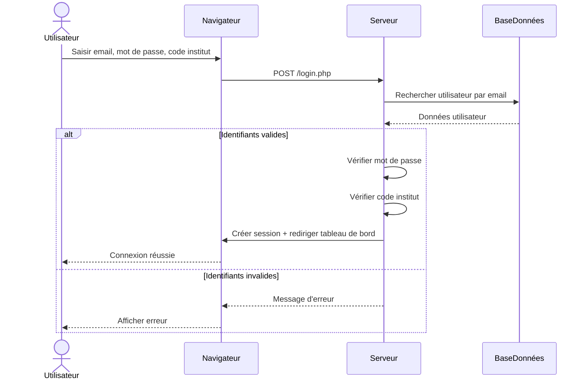

# Login - Sequence Diagram

```mermaid
sequenceDiagram
actor Utilisateur
participant Navigateur
participant Serveur
participant BaseDonnées

Utilisateur->>Navigateur: Saisir email, mot de passe, code institut
Navigateur->>Serveur: POST /login.php

Serveur->>BaseDonnées: Rechercher utilisateur par email
BaseDonnées-->>Serveur: Données utilisateur

alt Identifiants valides
    Serveur->>Serveur: Vérifier mot de passe
    Serveur->>Serveur: Vérifier code institut
    Serveur->>Navigateur: Créer session + rediriger tableau de bord
    Navigateur-->>Utilisateur: Connexion réussie
else Identifiants invalides
    Serveur-->>Navigateur: Message d'erreur
    Navigateur-->>Utilisateur: Afficher erreur
end
```
