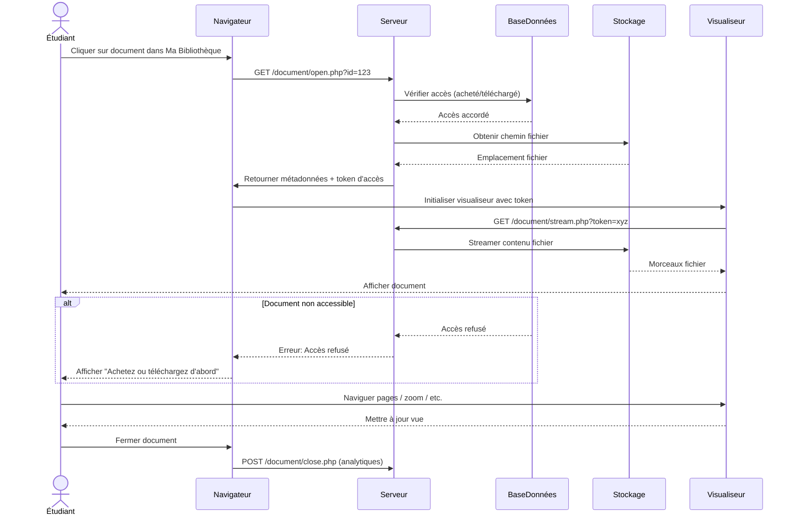

# Open Document - Sequence Diagram

```mermaid
sequenceDiagram
actor Étudiant
participant Navigateur
participant Serveur
participant BaseDonnées
participant Stockage
participant Visualiseur

Étudiant->>Navigateur: Cliquer sur document dans Ma Bibliothèque
Navigateur->>Serveur: GET /document/open.php?id=123
Serveur->>BaseDonnées: Vérifier accès (acheté/téléchargé)
BaseDonnées-->>Serveur: Accès accordé
Serveur->>Stockage: Obtenir chemin fichier
Stockage-->>Serveur: Emplacement fichier
Serveur->>Navigateur: Retourner métadonnées + token d'accès
Navigateur->>Visualiseur: Initialiser visualiseur avec token
Visualiseur->>Serveur: GET /document/stream.php?token=xyz
Serveur->>Stockage: Streamer contenu fichier
Stockage-->>Visualiseur: Morceaux fichier
Visualiseur-->>Étudiant: Afficher document

alt Document non accessible
    BaseDonnées-->>Serveur: Accès refusé
    Serveur-->>Navigateur: Erreur: Accès refusé
    Navigateur-->>Étudiant: Afficher "Achetez ou téléchargez d'abord"
end

Étudiant->>Visualiseur: Naviguer pages / zoom / etc.
Visualiseur-->>Étudiant: Mettre à jour vue

Étudiant->>Navigateur: Fermer document
Navigateur->>Serveur: POST /document/close.php (analytiques)
```
