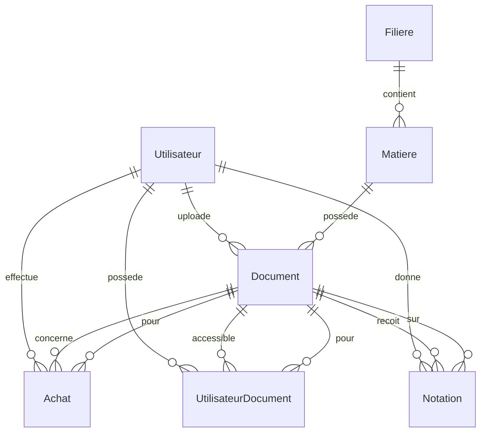

# Database - Entity Relationship Diagram

```mermaid
erDiagram
    Utilisateur ||--o{ Document : uploade
    Utilisateur ||--o{ Achat : effectue
    Utilisateur ||--o{ UtilisateurDocument : possede
    Utilisateur ||--o{ Notation : donne
    
    Filiere ||--o{ Matiere : contient
    Matiere ||--o{ Document : possede
    
    Document ||--o{ Achat : concerne
    Document ||--o{ UtilisateurDocument : accessible
    Document ||--o{ Notation : recoit
    
    Achat }o--|| Document : pour
    UtilisateurDocument }o--|| Document : pour
    Notation }o--|| Document : sur
```
