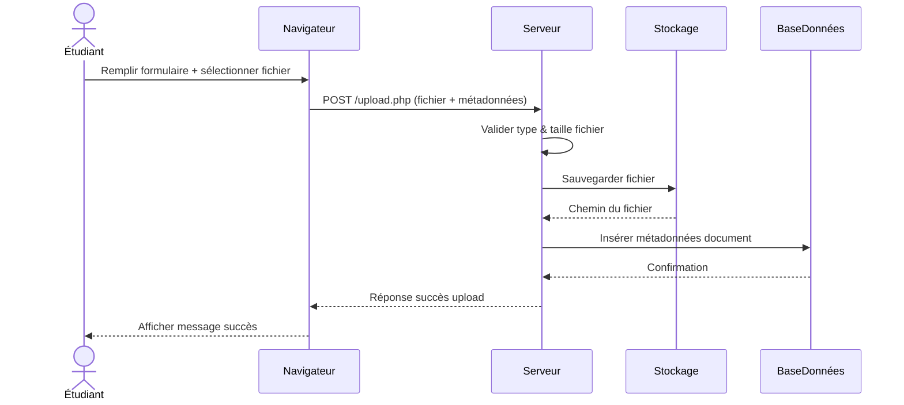

# Upload Document - Sequence Diagram

```mermaid
sequenceDiagram
actor Étudiant
participant Navigateur
participant Serveur
participant Stockage
participant BaseDonnées

Étudiant->>Navigateur: Remplir formulaire + sélectionner fichier
Navigateur->>Serveur: POST /upload.php (fichier + métadonnées)

Serveur->>Serveur: Valider type & taille fichier
Serveur->>Stockage: Sauvegarder fichier
Stockage-->>Serveur: Chemin du fichier

Serveur->>BaseDonnées: Insérer métadonnées document
BaseDonnées-->>Serveur: Confirmation

Serveur-->>Navigateur: Réponse succès upload
Navigateur-->>Étudiant: Afficher message succès
```
