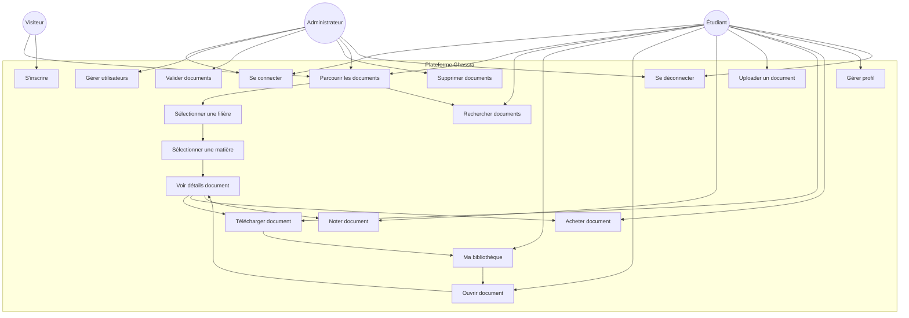

# Plateforme Ghassra - Use Case Diagram

```mermaid
graph TB
subgraph System[Plateforme Ghassra]
    direction TB
    
    Register[S'inscrire]
    Login[Se connecter]
    BrowseDocs[Parcourir les documents]
    SelectFiliere[Sélectionner une filière]
    SelectSubject[Sélectionner une matière]
    ViewDoc[Voir détails document]
    UploadDoc[Uploader un document]
    DownloadDoc[Télécharger document]
    OpenDoc[Ouvrir document]
    BuyDoc[Acheter document]
    ManageProfile[Gérer profil]
    ManageUsers[Gérer utilisateurs]
    ValidateDocs[Valider documents]
    RemoveDocs[Supprimer documents]
    Logout[Se déconnecter]
    SearchDocs[Rechercher documents]
    RateDoc[Noter document]
    MyLibrary[Ma bibliothèque]
end

User((Étudiant))
Admin((Administrateur))
Guest((Visiteur))

Guest --> BrowseDocs
Guest --> Register

User --> Login
User --> BrowseDocs
User --> SearchDocs
User --> MyLibrary
User --> OpenDoc
User --> RateDoc
User --> UploadDoc
User --> DownloadDoc
User --> BuyDoc
User --> ManageProfile
User --> Logout

Admin --> Login
Admin --> ManageUsers
Admin --> ValidateDocs
Admin --> RemoveDocs
Admin --> BrowseDocs
Admin --> Logout

BrowseDocs --> SelectFiliere
BrowseDocs --> SearchDocs
SelectFiliere --> SelectSubject
SelectSubject --> ViewDoc
ViewDoc --> DownloadDoc
ViewDoc --> BuyDoc
ViewDoc --> RateDoc
MyLibrary --> OpenDoc
DownloadDoc --> MyLibrary
OpenDoc --> ViewDoc
```
