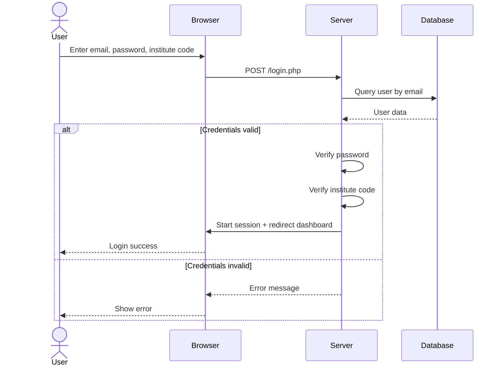

```mermaid
sequenceDiagram

actor User
participant Browser
participant Server
participant Database

User->>Browser: Enter email, password, institute code
Browser->>Server: POST /login.php

Server->>Database: Query user by email
Database-->>Server: User data

alt Credentials valid
    Server->>Server: Verify password
    Server->>Server: Verify institute code
    Server->>Browser: Start session + redirect dashboard
    Browser-->>User: Login success
else Credentials invalid
    Server-->>Browser: Error message
    Browser-->>User: Show error
end
```
