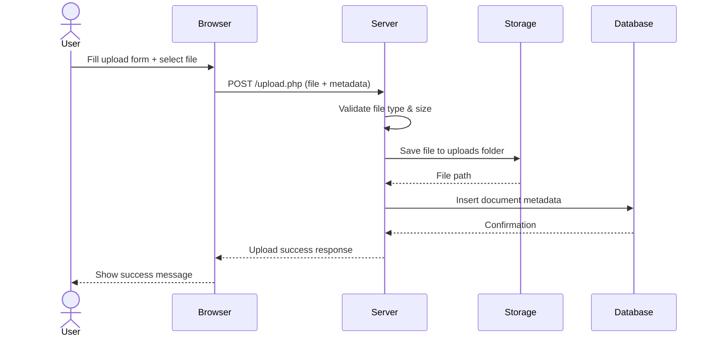

```mermaid
sequenceDiagram

actor User
participant Browser
participant Server
participant Storage
participant Database

User->>Browser: Fill upload form + select file
Browser->>Server: POST /upload.php (file + metadata)

Server->>Server: Validate file type & size
Server->>Storage: Save file to uploads folder
Storage-->>Server: File path

Server->>Database: Insert document metadata
Database-->>Server: Confirmation

Server-->>Browser: Upload success response
Browser-->>User: Show success message
```
