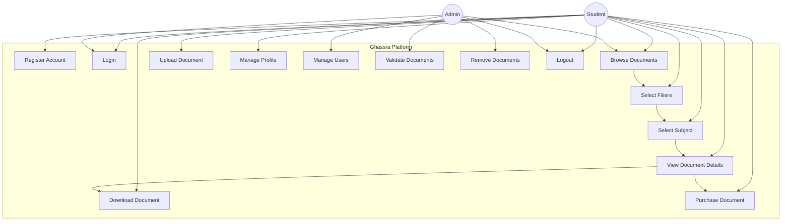

```mermaid
graph TB

subgraph System[Ghassra Platform]
  Register[Register Account]
  Login[Login]
  BrowseDocs[Browse Documents]
  SelectFiliere[Select Filiere]
  SelectSubject[Select Subject]
  ViewDoc[View Document Details]
  UploadDoc[Upload Document]
  DownloadDoc[Download Document]
  BuyDoc[Purchase Document]
  ManageProfile[Manage Profile]
  ManageUsers[Manage Users]
  ValidateDocs[Validate Documents]
  RemoveDocs[Remove Documents]
  Logout[Logout]
end

User((Student))
Admin((Admin))

User --> Register
User --> Login
User --> BrowseDocs
User --> SelectFiliere
User --> SelectSubject
User --> ViewDoc
User --> UploadDoc
User --> DownloadDoc
User --> BuyDoc
User --> ManageProfile
User --> Logout

Admin --> Login
Admin --> ManageUsers
Admin --> ValidateDocs
Admin --> RemoveDocs
Admin --> BrowseDocs
Admin --> Logout

BrowseDocs --> SelectFiliere
SelectFiliere --> SelectSubject
SelectSubject --> ViewDoc
ViewDoc --> DownloadDoc
ViewDoc --> BuyDoc
```
