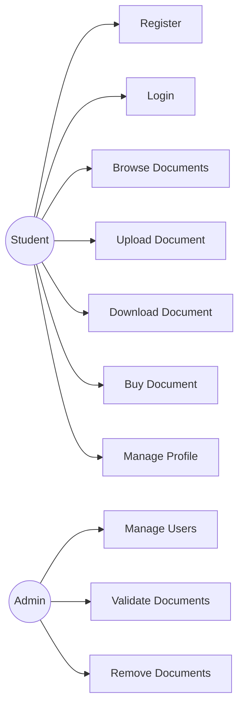

# Use Case Diagram — Ghassra

```mermaid
flowchart LR

User((Student))
Admin((Admin))

User --> Register
User --> Login
User --> BrowseDocs[Browse Documents]
User --> UploadDoc[Upload Document]
User --> DownloadDoc[Download Document]
User --> BuyDoc[Buy Document]
User --> ManageProfile[Manage Profile]

Admin --> ManageUsers[Manage Users]
Admin --> ValidateDocs[Validate Documents]
Admin --> RemoveDocs[Remove Documents]
```
